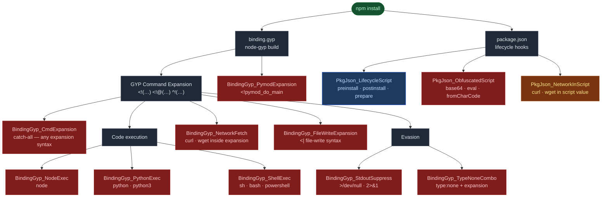

# gyp-rules

YARA rules for detecting malicious use of `binding.gyp` and `package.json` in npm packages.

Based on: **[Wait, binding.gyp Can Do What? Exploring npm's Weirdest Build System](https://www.aikido.dev/blog/exploring-binding-gyp-npm-build-system)** — Aikido Security

---

## Attack surface map



---

## Background

`binding.gyp` is GYP (Generate Your Projects) configuration used by npm to build native Node.js addons. It supports a command-expansion syntax — `<!(...)`, `<!@(...)`, `^!(...)` — that executes arbitrary shell commands at native-module build time, *before* any `package.json` lifecycle hook fires and outside the usual npm hook visibility.

The [Miasma worm](https://www.aikido.dev/blog/exploring-binding-gyp-npm-build-system) exploited this to achieve code execution with no `preinstall`/`postinstall` entries visible in `package.json`. This repo contains YARA rules that detect these techniques.

---

## Rules

### `rules/npm/binding_gyp.yar` — GYP command expansion

All rules carry `severity = "CRITICAL"` and link back to the Aikido source article.

| Rule | Technique | What it detects |
|---|---|---|
| `BindingGyp_CmdExpansion` | Command expansion | Any `<!(`, `<!@(`, or `^!(` pattern — broadest catch-all |
| `BindingGyp_NodeExec` | Command expansion | `node` invoked inside an expansion |
| `BindingGyp_PythonExec` | Command expansion | `python`/`python3` invoked inside an expansion |
| `BindingGyp_PymodExpansion` | Command expansion | `<!pymod_do_main` — runs a Python module at build time |
| `BindingGyp_ShellExec` | Command expansion | `sh`/`bash`/`powershell` inside an expansion |
| `BindingGyp_NetworkFetch` | Command expansion | `curl`/`wget` inside an expansion |
| `BindingGyp_StdoutSuppress` | Output hiding | `>/dev/null` or `2>&1` — suppresses execution evidence |
| `BindingGyp_TypeNoneCombo` | Side-effect target | `"type": "none"` combined with an expansion — no build artifact, pure execution |
| `BindingGyp_FileWriteExpansion` | File write | `<|` syntax — writes arbitrary content to files at build time |

### `rules/npm/package_json.yar` — lifecycle script abuse

| Rule | Severity | What it detects |
|---|---|---|
| `PkgJson_LifecycleScript` | LOW | `preinstall`/`postinstall`/`prepare` key present |
| `PkgJson_ObfuscatedScript` | CRITICAL | `base64`/`eval(`/`fromCharCode` in script values |
| `PkgJson_NetworkInScript` | HIGH | `curl`/`wget` in script values |

---

## Test coverage

All fixtures are **entirely synthetic** — no real malicious packages are used or downloaded.

### Techniques from the Aikido article covered by tests

| Technique | Rule(s) | Test |
|---|---|---|
| GYP command expansion (`<!(...)`) | `BindingGyp_CmdExpansion` | positive + negative |
| `node` execution via expansion | `BindingGyp_NodeExec` | positive + negative |
| `python`/`python3` via expansion | `BindingGyp_PythonExec` | positive + negative |
| `<!pymod_do_main` Python module run | `BindingGyp_PymodExpansion` | positive + negative |
| Shell (`sh`/`bash`/`powershell`) via expansion | `BindingGyp_ShellExec` | positive + negative |
| Network fetch (`curl`/`wget`) via expansion | `BindingGyp_NetworkFetch` | positive + negative |
| Output suppression (`>/dev/null`, `2>&1`) | `BindingGyp_StdoutSuppress` | positive + negative |
| Pure side-effect target (`"type": "none"` + expansion) | `BindingGyp_TypeNoneCombo` | positive + negative |
| File write via `<\|` expansion | `BindingGyp_FileWriteExpansion` | positive + negative |
| Lifecycle hook presence | `PkgJson_LifecycleScript` | positive + negative |
| Obfuscated script (`base64`/`eval`/`fromCharCode`) | `PkgJson_ObfuscatedScript` | positive + negative |
| Network call in lifecycle script | `PkgJson_NetworkInScript` | positive + negative |

```
poetry run pytest   # 29 tests, 0.02s
```

---

## Adding rules

Drop a `.yar` file into the appropriate folder — it is auto-discovered at runtime:

```
rules/
  npm/
    binding_gyp.yar
    package_json.yar
  community/        # external rulesets (GuardDog, ReversingLabs, etc.)
```

---

## Scanner

A Python scanner ships alongside the rules for local forensic analysis.

```bash
poetry install
poetry run scanner scan path/to/package/     # directory or .tgz
poetry run scanner report findings.json      # pretty-print saved findings
```

Output is structured JSON with rule ID, severity, file, line, raw snippet, and auto-decoded base64/hex/fromCharCode payloads.

Not a CI gate — depth over speed.
